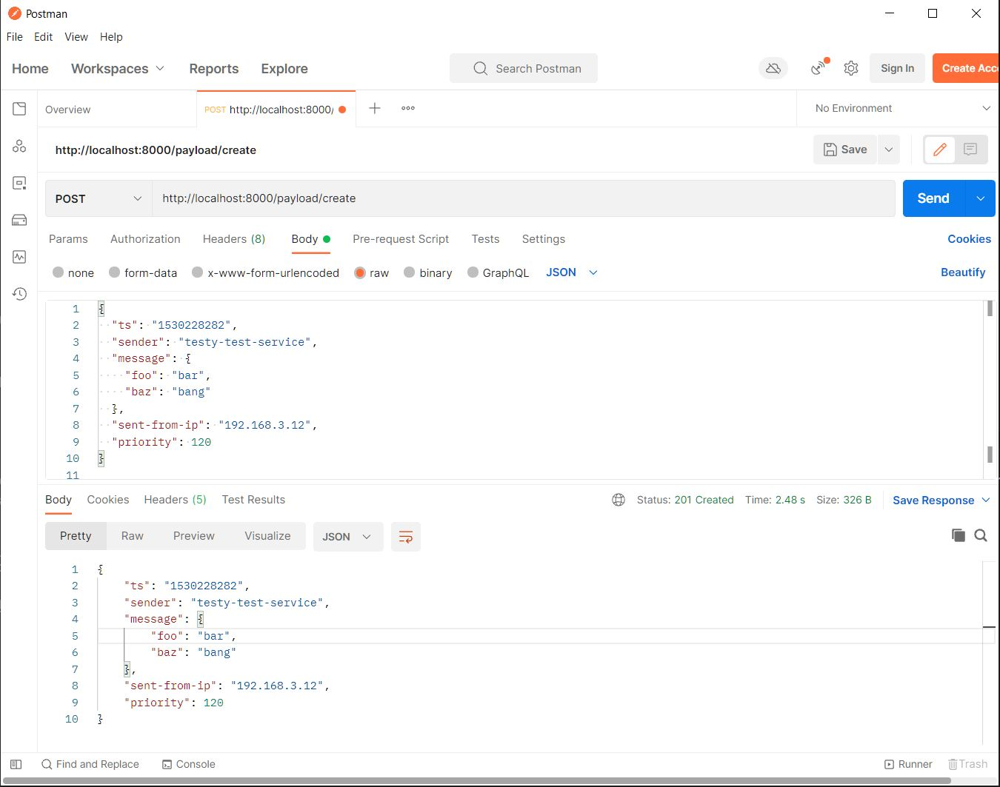

# UnityExercise
## App design and code structure
There are 3 projects. Key components and services:
- UnityExercise.Web: for the REST API.
  1. PayloadController: the controller for handling http requests. It calls <code>PayloadValidator</code> to validate client input before sending the input data to the message queue.
- UnityExercise.MQ: for RabbitMQ access. It sits in the middle between the Web and services layers for data transfer/transformation.
  1. IMessageSender: a service that can be used by message sender (the PayloadController in web layer).
  2. IMessageReceiver: an interface implemented by message receiver. The handler is triggered when the message queue has a new message (the service layer implements this handler). 
  3. RabbitMQReceiverBackgroundService: a long running background service monitoring message queue for message arrival and notifying message receivers.
- UnityExercise.Services: for app and domain services, data storage access, etc.
  1. IPayloadService: expose service API to create payload.
  2. PayloadValidator: use it to validate payload input according to the json schema <code>payload-schema.json</code>.
  
## Build and run locally in development environment (on Windows) 
### 1. Prerequisites
.NET 5 SDK + AspNetCore 5.0 runtime:

Check all installed .NET SDK:
```
dotnet --list-sdks
```
Check all installed .NET Runtime: 
```
dotnet --list-runtimes
```
Ensure you see there are version 5.0.x of SDKs and runtimes installed.

### 2. Spin up a RabbitMQ container
```
docker run -d --hostname my-rabbitmq-server --name rabbitmq -p 5672:5672 -p 15672:15672 rabbitmq:3.10-management
```        
Open in browser http://localhost:15672/ to validate RabbitMQ is running.

### 3. Prepare a SQL Server. 
You can use a local SQL Express or spin up a [SQL Server container][L1].
Open <code>UnityExercise\UnityExercise.Web\appsettings.json</code>, or <code>UnityExercise\UnityExercise.Web\appsettings.Development.json</code>, depending on what environment you run the app (development or production). Change the following <code>ConnectionStrings</code> accordingly (by default, a local SQL Express instance is used for development):
```
"ConnectionStrings": {
    "Default": "Server=(LocalDb)\\MSSQLLocalDB;Database=UnityExercise;Trusted_Connection=True;"
},
```

### 4. Create Database on Your SQL Server
Run script: <code>.\sqlserver\init-db.sql</code>

### 5. Build and run the app:
CD to <code>UnityExercise\UnityExercise.Web</code> folder, launch
```
dotnet run
```
You should see similar output in the console window
```
Building...
info: UnityExercise.Web[0]
        The app is configured to run in 'Development' environment.
info: Microsoft.Hosting.Lifetime[0]
        Now listening on: http://localhost:5000
info: Microsoft.Hosting.Lifetime[0]
        Application started. Press Ctrl+C to shut down.
info: Microsoft.Hosting.Lifetime[0]
        Hosting environment: Development
info: Microsoft.Hosting.Lifetime[0]
        Content root path: D:\github\UnityExercise\UnityExercise.Web
...
```
### 6. Test and verify app
Open in browser: http://localhost:5000/swagger/index.html. You can test the Payload/Create REST API from the Swagger webpage.

## Run the app in container environment
I've put together a docker-compose.yml file (including Dockerfile and other necessary scripts) that spins up everything. Simply run the docker-compose command:
```
docker compose -f docker-compose.yml up
```
This time, use Postman to test and verify the REST API as Swagger UI doesn' seem to work now.




Caveats:
1. There is timing issue. The app container may fail to start because the RabbitMQ container hasn't yet been ready to connect to. There is [solution][L2] but I haven't had time to try it out. Simply running "docker start" the app container again after RabbitMQ container is ready should bring everything online.
2. NO Swagger UI now because the app is running in "Production" environment when deployed to container. I could have moved the <code>UseSwaggerUI</code> out of the "if block" to make the UI available, or made it run in "Development" in container.

```c#
            if (env.IsDevelopment())
            {
                app.UseDeveloperExceptionPage();

                app.UseSwagger();
                app.UseSwaggerUI(c => c.SwaggerEndpoint("/swagger/v1/swagger.json", "UnityExercise.Web v1"));
            }

```
## Deploy to k8s cluster

[L1]: https://docs.microsoft.com/en-us/sql/linux/sql-server-linux-docker-container-deployment?view=sql-server-ver15&pivots=cs1-bash
[L2]: https://stackoverflow.com/questions/31746182/docker-compose-wait-for-container-x-before-starting-y/41854997#41854997
